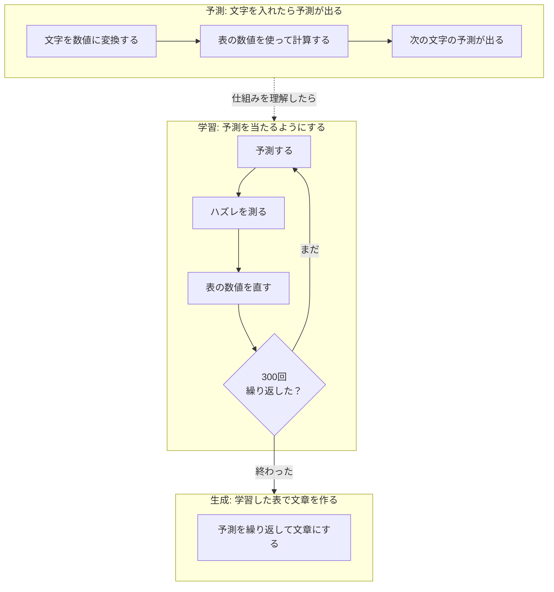
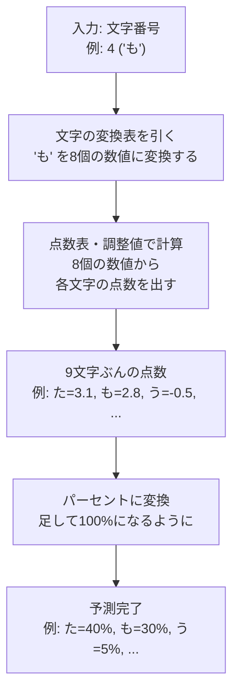
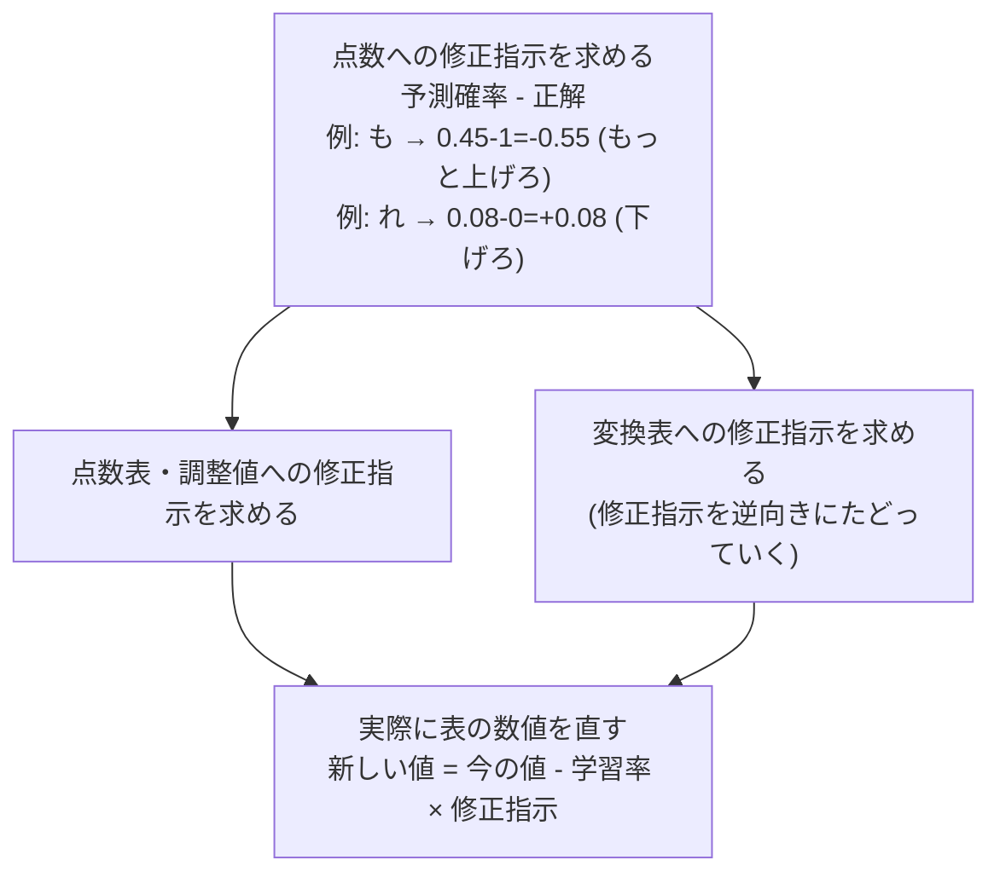

# tiny.py の全体像

## そもそもAIって何をやってるの？

AIがやってることは「次の文字を当てるゲーム」。

「も」と入力されたら「次は "も" かな？ "た" かな？」と予測を返す。ChatGPT のような大規模なものも、根っこの仕組みはこれと同じ。

## 全体の流れ

このプログラムがやることは3つだけ。



## 予測: 文字を入れたら予測が出る

じゃあどうやって当てるのか？ プログラムの中に「数値がたくさん入った表」がある。入力された文字とこの表の数値を使って計算すると、予測が1つ出てくる。

### 文字を数値に変換する — `Vocab` クラス

コンピュータは「も」「た」みたいな文字をそのまま計算に使えない。だから最初に、文字に番号を振る。

| 文字 | う | か | た | は | も | ら | ろ | ま | れ |
|------|----|----|----|----|----|----|----|----|-----|
| 番号 | 0  | 1  | 2  | 3  | 4  | 5  | 6  | 7  | 8  |

これで「ももたろう」は `[4, 4, 2, 6, 0]` という数値の列になって、計算に使える。

### 予測に使う3つの表 — `TinyLM.__init__()`

予測には3つの「数値の表」を使う。最初は適当な数値が入っている。

| 表の名前 | 大きさ | 何をするための表か |
|----|--------|----|
| 文字の変換表 | 9文字 × 8個の数値 = 72個 | 文字番号を渡すと、その文字を8個の数値に変換して返してくれる表。辞書みたいなもの |
| 予測の点数表 | 8 × 9 = 72個 | 変換表から出てきた8個の数値と掛け合わせて、次にどの文字が来そうかの「点数」を出すための表 |
| 予測の調整値 | 9個 | 点数に足す微調整の数値 (なぜ必要かは下で説明) |

合計 **153個** の数値。これがこのAIの全て。

### 予測の流れ — `forward()`

3つの表を紹介したところで、実際に「も」を入力したら何が起きるか見てみる。



**文字の変換表を引く**
文字番号を使って変換表からその文字の行を取り出す。「も」= 番号4 なら、変換表の4行目を取り出す。8個の数値が出てくる。最初は適当な数値だけど、学習を繰り返すうちに意味のある値になっていく。

**点数表・調整値で計算する**
変換表から取り出した8個の数値と、点数表の数値を1つずつ掛けて全部足す。これで「次にどの文字が来そうか」の点数が9文字ぶん出てくる。

なぜ「掛けて足す」で予測になるのか？ 点数表の中の数値が大きいところほど、結果に強く影響する仕組みになっている。学習を繰り返すと、正解の文字に高い点数がつくように点数表の数値が調整されていく。

ただし、掛け算だけだと「この文字はそもそも来やすい/来にくい」という全体的な底上げ・底下げができない。テストで例えると、点数表が「配点 × 回答」で出した素点なら、調整値は「この科目は難しかったから全員に+5点」のような加点。だから調整値を最後に足す。

**点数をパーセントに変換する**
ここまでで各文字の点数は出た。でも点数のままだと困る。「た=3.1, も=2.8」で何%くらいありそうか比べにくいし、マイナスの値もある。そこで、どんな数値でもパーセントに変換できる数学の公式を使う（コードでは `np.exp` → 合計で割る、の部分）。

これで「も」を入力したら「た=40%, も=30%, う=5%, ...」のような予測が出る。

---

## 学習: 予測を当たるようにする

予測の仕組みはわかった。でも最初は表の数値が適当だから、予測は全然当たらない。ここからが本番で、**予測 → ハズレ測定 → 修正** を繰り返して、表の数値を良くしていく。

AIの世界では、この表の数値のことを「**重み (weight)**」、重みを何度も直していく作業のことを「**学習 (training)**」と呼ぶ。でも中身は「表の数値を書き換えてるだけ」。

### 具体例で見る学習の過程

学習データは「ももたろうはももからうまれた」。「も」の次は「も」か「た」か「か」が正解。

**1回目** — 表の数値はデタラメだから、予測もデタラメ。

| 入力 | 正解 | 予測 (上位3つ) | 結果 |
|------|------|------|------|
| も | も | れ=25%, う=20%, か=18%... | 全然ダメ。「も」にほとんど確率を振れてない |

ハズレがひどい → 表の数値を大きく直す。

**100回目** — だいぶマシになってきた。

| 入力 | 正解 | 予測 (上位3つ) | 結果 |
|------|------|------|------|
| も | も | も=45%, た=20%, か=15%... | 正解の「も」が1位に上がってきた |

ハズレが小さくなった → 修正量も小さくなる。

**300回目** — かなり当たるようになった。

| 入力 | 正解 | 予測 (上位3つ) | 結果 |
|------|------|------|------|
| も | も | も=60%, た=20%, か=15%... | 正解にしっかり確率を振れている |

これが「学習」の全体像。あとは各ステップの中身を見ていく。

### ハズレを測る — `loss()`

予測が出たら「どのくらい間違えたか」を1つの数値にしたい。この数値が大きいほどハズレがひどく、小さいほど良い予測。この数値は学習の進み具合を確認するためのもので、なくても学習自体は動く（実際に表を直すのは次の `backward()` の仕事）。

実行するとこんな出力が出る:
```
step   0  loss=2.497
step 100  loss=0.443
step 200  loss=0.434
```
数値が減っていってるから「学習がうまく進んでる」とわかる。もし減ってなかったら「何かおかしい」と気づける。

考え方はシンプルで、正解の文字に何%を振れたかを見る:
- 正解が「も」で、「も」に60%を振れていた → 良い → ハズレは小さい
- 正解が「も」で、「も」に2%しか振れてなかった → ひどい → ハズレは大きい

正解の確率が低いほどハズレの度合いが大きくなる、という計算をしたい。これにぴったりな数学の関数 (log) がある。log は確率を入れると 0 かマイナスの値を返す関数で、確率が低いほど大きなマイナスになる:

```
log(0.8)  = -0.22   (確率高い → 0に近い)
log(0.1)  = -2.30
log(0.02) = -3.91   (確率低い → 大きなマイナス)
log(1.0)  =  0      (確率100% → ぴったり0)
```

ハズレの度合いは「大きいほど悪い」にしたいのに、log の結果はマイナスになる。だからマイナスをつけて符号をひっくり返す（コードでは `-np.log(確率)` の部分）:

```
-log(0.8)  = 0.22   (正解に80%振れてる → ハズレほぼなし)
-log(0.1)  = 2.30   (正解に10%しか振れてない → ハズレ大きい)
-log(0.02) = 3.91   (正解に2%しか振れてない → ハズレひどい)
```

### 3つの表の数値を直す — `backward()`

ここが学習の本体。`loss()` の値を直接使うわけではなく、予測確率と正解から直接「変換表・点数表・調整値のどの数値を、どっちの方向に、どれだけ直せばいいか」を計算する。

イメージ: 山の中で目隠しされている状態で、一番低い谷に行きたい（= ハズレを最小にしたい）。足元の傾きを感じて「こっちが下り坂だ」とわかったら、そっちに一歩進む。また傾きを感じて、また一歩。これを繰り返して谷を目指す。「足元の傾き」が修正指示で、「一歩進む」が表の数値を直す作業。



修正指示の出し方はシンプルで「予測確率 - 正解」。正解の文字は「確率が足りない分だけ上げろ」という指示になり、不正解の文字は「今の確率ぶんだけ下げろ」という指示になる。

3つの表すべてに修正指示が行き渡ったら、実際に数値を直す。式はこれだけ:
```
新しい数値 = 今の数値 - 学習率 × 修正指示
```
「学習率」は一歩の大きさ。大きすぎると谷を飛び越える。小さすぎると進みが遅い。

---

## 生成: 学習した表で文章を作る — `generate()`

300回も数値を直した表は、もうだいぶ良い予測ができるようになっている。

生成でやることは、予測を繰り返すだけ:
1. 「も」を入力 → 予測が出る → 確率に従ってサイコロを振り「も」を選ぶ
2. 「も」を入力 → 予測が出る → サイコロを振り「た」を選ぶ
3. 「た」を入力 → 予測が出る → サイコロを振り「ろ」を選ぶ
4. ...こうして「ももたろうは...」のような文章ができあがる

40%の文字は40%の確率で選ばれ、2%の文字は2%の確率で選ばれる。だから毎回ちょっと違う文章が出てくる。

---

## 数値の表のまとめ

| 名前 | 大きさ | 役割 |
|------|------|------|
| 文字の変換表: `emb_weight` | 9×8 = 72個 | 文字番号 → 8個の数値に変換 |
| 予測の点数表: `linear_weight` | 8×9 = 72個 | 変換された数値 → 各文字の点数 |
| 予測の調整値: `linear_bias` | 9個 | 点数に足す底上げ・底下げ用の値 |
| **合計** | **153個** | |

## 専門用語との対応

ここまで読めば、もう中身はわかっているはず。あとはそれぞれの操作に業界でどんな名前がついているかだけ。

| このドキュメントでの説明 | 専門用語 |
|---|---|
| 表の数値 | 重み (weight) / パラメータ (parameter) |
| 表の数値を何度も直していく作業 | 学習 (training) |
| 文字番号で変換表を引いて数値を取り出す | Embedding (埋め込み) |
| 掛け算と足し算で点数を出す | Linear (線形変換) |
| 点数をパーセントに変換する | softmax (ソフトマックス) |
| ハズレを1つの数値にしたもの | Cross Entropy Loss (交差エントロピー損失) |
| 各数値への修正指示 | 勾配 (gradient) |
| 修正指示を後ろから前に伝えること | 逆伝播 (Backpropagation) |
| 修正指示に従って数値を直すやり方 | SGD (確率的勾配降下法) |
| データを前に流して予測を出す処理 | 順伝播 (Forward pass) |
