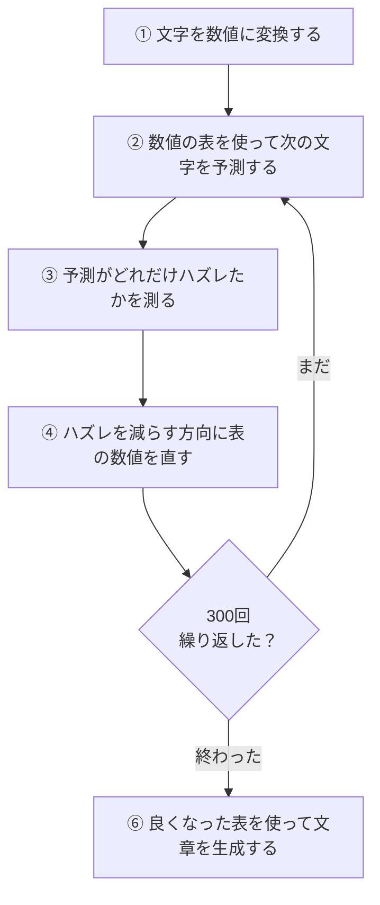
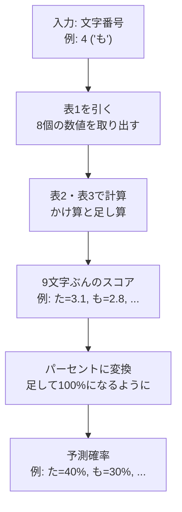
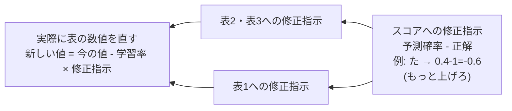

# tiny.py の全体像

## そもそもAIって何をやってるの？

AIがやってることは「次の文字を当てるゲーム」、ただそれだけ。

「も」と入力されたら「次は "も" かな？ "た" かな？」と予測を返す。ChatGPT のような大規模なものも、根っこの仕組みはこれと同じ。

じゃあどうやって当てるのか？ プログラムの中に「数値がたくさん入った表」がある。入力された文字とこの表の数値を使って計算すると、予測が1つ出てくる。

最初、表には適当な数値が入ってるから、予測は全然当たらない。そこで「どのくらいハズレたか」を数値で測って、表の中の数値をちょっとだけ直す。また予測する → またハズレる → また直す。これを何百回も繰り返すと、表の数値がだんだん良くなって、予測が当たるようになる。

AIの世界では、この表の数値のことを「**重み (weight)**」、重みを何度も直していく作業のことを「**学習 (training)**」と呼ぶ。でも中身は「表の数値を書き換えてるだけ」。

## 全体の流れ



## 各ステップの詳細

### ① 文字を数値に変換する — `Vocab` クラス

コンピュータは「も」「た」みたいな文字をそのまま計算に使えない。だから最初に、文字に番号を振る。

| 文字 | う | か | た | は | も | ら | ろ | ま | れ |
|------|----|----|----|----|----|----|----|----|-----|
| 番号 | 0  | 1  | 2  | 3  | 4  | 5  | 6  | 7  | 8  |

これで「ももたろう」は `[4, 4, 2, 6, 0]` という数値の列になって、計算に使える。

### ② 数値の表を使って次の文字を予測する — `forward()`



**表1を引く**
文字番号を使って表1からその文字の行を取り出す。1文字につき8個の数値が出てくる。最初は適当な数値だけど、学習を繰り返すうちに意味のある値になっていく。

**表2・表3で計算する**
取り出した8個の数値と表2の数値をかけて足し合わせ、さらに表3を足す。すると「次にどの文字が来そうか」のスコアが全9文字ぶん出てくる。中身はかけ算と足し算だけ。

**スコアをパーセントに変換する**
スコアのままだと「た=3.1, も=2.8」で、何%くらいありそうか比べにくい。マイナスの値もある。そこで全部足して100%になるようにパーセントに変換する。

手順:
1. 数値が大きすぎると計算が壊れるので、全スコアからいちばん大きい値を引く（結果は変わらない）
2. 各スコアに対して「eのスコア乗」を計算する。スコアが大きいほど結果がドンと大きくなるので、差が強調される
3. 全部足して、各値をその合計で割る → 合計がちょうど100%になる

### ③ 予測がどれだけハズレたかを測る — `loss()`

予測が出たら、次は「どのくらい間違えたか」を1つの数値にしたい。この数値が大きいほどハズレがひどく、小さいほど良い予測。

考え方はシンプルで、正解の文字に何%を振れたかを見る:
- 正解が「た」で、「た」に80%を振れていた → 良い → ハズレは小さい
- 正解が「た」で、「た」に2%しか振れてなかった → ひどい → ハズレは大きい

具体的には log(正解の確率) にマイナスをつけた値を使う:
- 確率80% → -log(0.8) ≒ 0.22 (小さい = 良い)
- 確率2% → -log(0.02) ≒ 3.9 (大きい = ハズレ)
- 確率100% → -log(1.0) = 0 (完璧)

なぜ log を使うかというと、確率が低いときにペナルティがドカンと跳ね上がるから。50%→10% の悪化より、10%→1% の悪化のほうが深刻で、log はそれを自然に反映してくれる。

### ④ ハズレを減らす方向に表の数値を直す — `backward()`

ハズレを測ったら、次は「表のどの数値を、どっちの方向に、どれだけ直せばいいか」を計算する。

イメージ: 山の中で目隠しされている状態で、一番低い谷に行きたい（= ハズレを最小にしたい）。足元の傾きを感じて「こっちが下り坂だ」とわかったら、そっちに一歩進む。また傾きを感じて、また一歩。これを繰り返して谷を目指す。「足元の傾き」が修正指示で、「一歩進む」が表の数値を直す作業。



修正指示を後ろから前に伝えていく。予測の最後で出たハズレを、逆向きにたどって表1まで伝える。

実際に表の数値を直す式はこれだけ:
```
新しい数値 = 今の数値 - 学習率 × 修正指示
```
「学習率」は一歩の大きさ。大きすぎると谷を飛び越える。小さすぎると進みが遅い。

### ⑥ 良くなった表を使って文章を生成する — `generate()`

300回も数値を直した表は、もうだいぶ良い予測ができるようになっている。あとは1文字ずつ「予測 → その文字を次の入力にする → また予測 → ...」を繰り返すだけ。

予測された確率に従って、サイコロを振るように1文字を選ぶ。40%の文字は40%の確率で選ばれ、2%の文字は2%の確率で選ばれる。

## 数値の表のまとめ

| 名前 | 形 | 役割 |
|------|------|------|
| 表1: `emb_weight` | 9×8 = 72個 | 文字番号 → 8個の特徴数値 |
| 表2: `linear_weight` | 8×9 = 72個 | 特徴数値 → 各文字のスコア |
| 表3: `linear_bias` | 9個 | スコアに足す調整値 |
| **合計** | **153個** | |

## 専門用語との対応

ここまで読めば、もう中身はわかっているはず。あとはそれぞれの操作に業界でどんな名前がついているかだけ。

| このドキュメントでの説明 | 専門用語 |
|---|---|
| 表の数値 | 重み (weight) / パラメータ (parameter) |
| 表の数値を何度も直していく作業 | 学習 (training) |
| 文字番号で表1を引いて数値を取り出す | Embedding (埋め込み) |
| かけ算と足し算でスコアを出す | Linear (線形変換) |
| スコアをパーセントに変換する | softmax (ソフトマックス) |
| ハズレを1つの数値にしたもの | Cross Entropy Loss (交差エントロピー損失) |
| 各数値への修正指示 | 勾配 (gradient) |
| 修正指示を後ろから前に伝えること | 逆伝播 (Backpropagation) |
| 修正指示に従って数値を直すやり方 | SGD (確率的勾配降下法) |
| データを前に流して予測を出す処理 | 順伝播 (Forward pass) |
