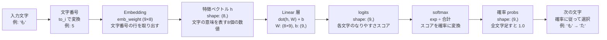
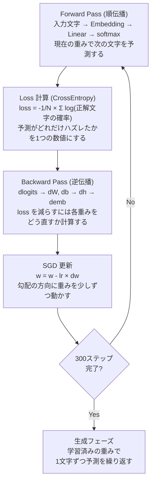

# tiny.py ネットワーク構造図

## 図1: データの流れ (Forward Pass)

入力文字がどのように変換されて「次の文字の予測」になるかを示す。

```mermaid
flowchart LR
    A["入力文字<br>例: 'も'"]
    B["文字番号<br>to_i で変換<br>例: 5"]
    C["Embedding<br>emb_weight (9×8)<br>文字番号の行を取り出す"]
    D["特徴ベクトル h<br>shape: (8,)<br>文字の意味を表す8個の数値"]
    E["Linear 層<br>dot(h, W) + b<br>W: (8×9), b: (9,)"]
    F["logits<br>shape: (9,)<br>各文字のなりやすさスコア"]
    G["softmax<br>exp ÷ 合計<br>スコアを確率に変換"]
    H["確率 probs<br>shape: (9,)<br>全文字足すと 1.0"]
    I["次の文字<br>確率に従って選択<br>例: 'も' → 'た'"]

    A --> B --> C --> D --> E --> F --> G --> H --> I
```

## 図2: 学習ループ

300ステップ繰り返して重みを改善する全体フロー。

```mermaid
flowchart TD
    A["Forward Pass (順伝播)<br>入力文字 → Embedding → Linear → softmax<br>現在の重みで次の文字を予測する"]
    B["Loss 計算 (CrossEntropy)<br>loss = -1/N × Σ log(正解文字の確率)<br>予測がどれだけハズレたかを1つの数値にする"]
    C["Backward Pass (逆伝播)<br>dlogits → dW, db → dh → demb<br>loss を減らすには各重みをどう直すか計算する"]
    D["SGD 更新<br>w = w - lr × dw<br>勾配の方向に重みを少しずつ動かす"]
    E{"300ステップ<br>完了?"}
    F["生成フェーズ<br>学習済みの重みで<br>1文字ずつ予測を繰り返す"]

    A --> B --> C --> D --> E
    E -- "No" --> A
    E -- "Yes" --> F
```
